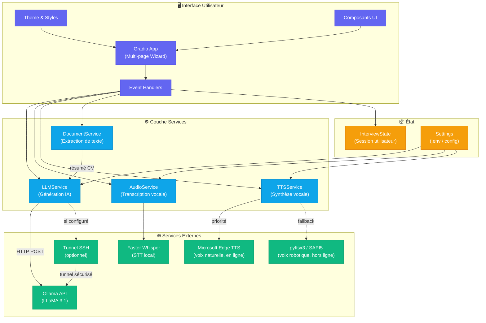

# PoC - Interview module:

This module is a PoC for a French job interview.

It is mainly supposed to work locally, but can be temporarily deployed online thanks to Gradio.


## Requirements

To run the project, you'll need the following tools:
- Python 3.10 +
- Ollama 0.9.5+


## Installation

First, we advise you to create a venv (virtual environment) in order to avoid version issues 
in either this or your other projects.


### Ollama

First, you need to set up the generative IA:

```shell
ollama pull llama3.1:8b
```

If you **don't** use Ollama desktop app, you also need to manually start the server with:

```shell
ollama serv
```

NB: mistral could be replaced by the generative IA of your choice, mostly depending on your available
compute resources. 

For any model change, you need to pull it and change the value of **generative_ai_model** in **globals.py**


### Requirements

First, [install pip](https://pip.pypa.io/en/stable/installation/) by following the link. Follow the instructions
depending on your OS.

Then you'll have to pull the requirements through python's package installer **pip** 
from the root directory of your project:

```shell
pip install -r requirements.txt
```


## Run the project

Once everything is correctly installed and Ollama server is up,
you can directly run the **"main.py"** file.

```shell
python main.py
```


### Customisation

You can customize interview parameters in the first part of the **"globals.py"** file. They are ordered by name.

NB: The second part is dynamically changed during use, so changing it will mostly have no effect.


## Issues

#### - I want my module to run on a public link

In **main.py**, change
```
app.launch()
```
by
```
app.launch(share=True)
```

#### - The transcription of answers is laggy or takes too long.

You can edit the model used in **audio_utils.py** by editing the following line:
```
model = WhisperModel("medium", compute_type="int8", device="cpu")
```


## Architecture Technique



## Licence

This project is owned by **Formasup Odyssée**. 
All rights reserved.